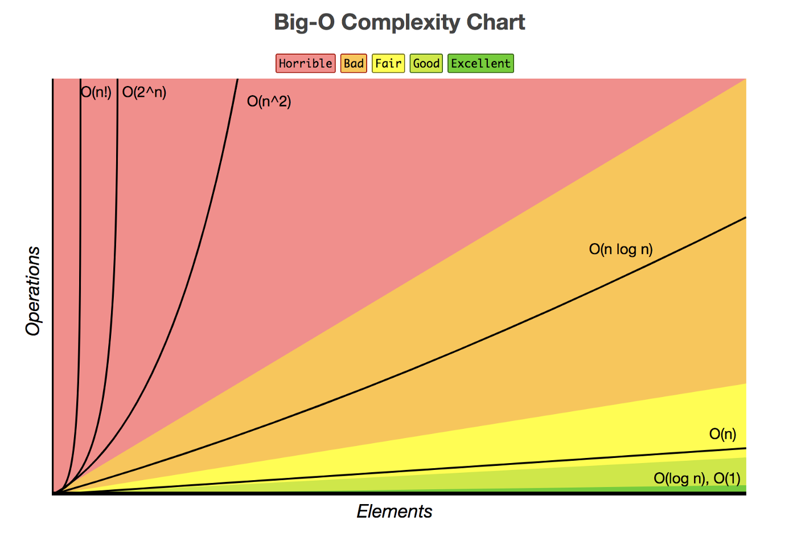

## Big O ဆိုတာ ဘာလဲ။

 developer များသည် ပရိုဂရမ်တစ်ခုကို နည်းလမ်းများစွာဖြင့် ရေးသားနိုင်ပါတယ်။

ဥပမာအနေနဲ့ဒေတာဖွဲ့စည်းပုံအတွင်း အကြောင်းအရာတစ်ခုကို ရှာဖွေရန် နည်းလမ်းများစွာရှိသည်။ linear search၊ binary search၊ jump search၊ interpolation search နှင့် အခြားရွေးချယ်စရာများစွာတို့ကို သုံးနိုင်သည်။သို့သ်ောလက်ရှိပြဿနာပေါ် မူတည်၍ မည်သည့် algorithm ကို အသုံးပြုရမည်ကို နားလည်ရန် အရေးကြီးပါသည်။

## what is algorithm

ကွန်ပြူတာ algor‌ithm ဆိုသည်မှာinputတစ်ခုကိုယူ၍ output တစ်ခုကိုတွက်ချက်ရန်အတွက် စက်မှလုပ်ဆောင်သော အဆင့်များဖြစ်သည်။ ထိုအရာရဲ့စွမ်းဆောင်ရည်ကိုတိုင်းတာရန်နည်းလမ်းများစွာရှိသည်။ထိုအထဲမှာမှ ကျွန်တ်ောက Big Oအကြောင်းပြောမှာဖြစ်ပါတယ်။

## What is big O
Big O notation သည် algorithm တစ်ခုလည်ပတ်ရန် အချိန်မည်မျှကြာသည် သို့မဟုတ် algorithm (space complexity) ဖြင့် memory မည်မျှအသုံးပြုသည်ကို ပြရန်အတွက် အသုံးပြုသော ဘာသာစကားဖြစ်သည်။ Big O notation သည် အယ်လဂိုရီသမ်တစ်ခု၏ အကောင်းဆုံး၊ အဆိုးဆုံးနှင့် ပျမ်းမျှအားဖြင့် လည်ပတ်နေသည့်အချိန်ကို ဖော်ပြနိုင်သည်။ 


## what is time complexity
ထည့်သွင်းထားသောဒေတာ၏အရွယ်အစားပြောင်းလဲမှုပေါ်မူတည်၍ တွက်ချက်မှုအချိန်ရှုပ်ထွေးခြင်းသည် algorithm တစ်ခု၏ runtime ပြောင်းလဲမှုအား ဖော်ပြသည်။

## what is Space complexity 
Space complaxity သည် input size၏ အရွယ်အစားပေါ် မူတည်၍ algorithm တစ်ခု input data မည်မျှ လိုအပ်ကြောင်း ဖော်ပြသည်။


ကျွန်ုပ်တို့၏ကွန်ပြူတာသည်လုပ်ဆောင်ချက်တစ်ခုလုပ်ဆောင်ရန်အတွက်အချိန်နာရီကိုမှတ်တမ်းတင်ထားသည်။ပြီးနောက်programနှစ်ခုကိုနှိုင်းယှဉ်ရန်ဤအချိန်နာရီကို အသုံးပြုသည်။ သို့သော် အချိန်နာရီသည် hardware ပေါ်တွင်မူတည်သည်။ efficient program တစ်ခုသည် မြန်ဆန်သောကွန်ပျူတာရှိ inefficient program ထက် နှေးကွေးသောကွန်ပြူတာတွင်လုပ်ဆောင်ရန် အချိန်ပိုယူနိုင်သည်။

ထို့ကြောင့်အချိန်နာရီသည် complexityကို ရှာဖွေရန် ကောင်းသောmatrixတစ်ခုမဟုတ်ပါ။ဒါကြောင့်progra-m နှစ်ခု၏ complexityကိုနှိုင်းယှဉ်ရန်ကျွန်တ်ောတို့ ဘယ်ဟာကို  သုံးနိုင်မလဲ။ အဖြေကတေ့ာ Big(O) ဖြစ်ပါတယ်။Big(O)သည်အမြန်နှုန်းတိုင်းတာခြင်းအကြောင်းမဟုတ်ပါဘူး၊ ထိုအရာသည် ပရိုဂရမ်တစ်ခု၏ input scales  တစ်ခုအနေဖြင့် လုပ်ဆောင်ရမည့် အလုပ်ပမာဏကို တိုင်းတာခြင်းဖြစ် ပါသည်။

Complexity ကိုတိုင်းတဲ့အခါမှာ ဘယ်အပေါ်မူတည်ပြီး တွက်သလဲဆိုတော့ input size အပေါ်မူတည်ပြီး တွက်ပါတယ်။ ဉပမာ ကျတော်တို.က အခန်း 10 ခုရှိတဲ့ array ကို sort လုပ်မယ်ဆိုပါစို. ဒါဆိုရင် input size n သည် 10 ပါ။ သူ.အပေါ်မူတည်ပြီး ဘယ် sorting algorithm သည် အကောင်းဆုံး ဖြစ်မလဲဆိုတာကို ရွေးလို.ရပါတယ်။
ဉပမာ sorting algorithm ၁ က သူ.ရဲ. time complexity က O(n) ဆိုပါစို. Sorting algorithm ၂ က O(n^2) ဆိုပါစို. ဒီနေရာမှာ n နဲ. n^2 ဘယ်သူက များသလဲဆိုတော့ n^2 က များပါတယ် ဒါဆိုကျတော်တို.က generally O(n) ဖြစ်တဲ့ကောင်ကို ရွေးရမှာပါ။
O(n) ကို Order of n လို.ဖတ်ပါတယ်။ 
ဒီနေရာမှာOrder ဆိုတာဘာလဲဆိုတာ ရှင်းပြဖို.လိုပါတယ်။Big O notation သည် Math notation ပါ။Oသည်ဘာကိုတိုင်းတာလဲဆိုရင် upper bound ကိုတိုင်းတာပါ။ နားလည်လွယ်အောင် ရှင်းပြရရင်worstcaseကိုတိုင်းတာပါ၊worst case အပြင် best case အကြောင်းကိုလဲပြောရပါဦးမယ်။ 
O(1)
Constant time algorithms သည် အမြဲတမ်း တူညီသော အချိန်ပမာဏကို လုပ်ဆောင်မည်ဖြစ်သည်။ ဤ algorithm ၏ လုပ်ဆောင်ချိန်သည် input size နှင့် သီးခြား စီဖြစ်သည်။
## e.g
``` javascript
var arr = [1,2,3,4,5];
arr[2]; 
```


O(n)
 Linear time complexity 
algorithm တစ်ခုတွင် algorithm ကို လုပ်ဆောင်ရန်အချိန်သည် input size n နှင့် တိုက်ရိုက်အချိုးကျပါက algorithm ကို run ရန် အချိန်သည် input n အရွယ်အစား တိုးလာသည်နှင့်အမျှ အချိုးကျ တိုးလာမည်ဖြစ်သည်။
## e.g

``` javascript
for (var i = 0; i &lt; array.length; i++) {
	 console.log(array[i]);
	 }
var arr = [orange၊ apple၊ banana၊ lemon];
```


O(n^2) - Quadratic time complexity
 algorithm တစ်ခုတွင် input size၏ square နှင့် အချိုးကျနေပါက လုပ်ဆောင်ရန်အချိန်သည် Quadratic time complexityရှိသည်။ loopနှစ်ထပ်ပါရှိသော algorithmတွင်  quadratic time complexityကိုတွေ့ရမည်ဖြစ်သည်။ပြောရမယ်ဆိုရင် loop ပိုပတ်လျှင် O(n^3), O(n^4) ကဲ့သို့ complexity များကိုပါဖြစ်စေနိုင်သည်။
## e.g
``` javascript
for(var i = 0; i < length; i++) {     //has O(n) time complexity    
for(var j = 0; j < length; j++) {    //has O(n^2) time complexity      //   
 }}
```

အထက်ပါဥပမာများမှာworst case နှင့် best case ကိုနိူင်းယှဥ်ပြခြင်းဖြစ်သည်။O(n)မှာပြထားသောဥပမာတွင်array ထဲရှိမည့်သည့်အရာကိုရှာသည်ဖြစ်စေ loopတစ်ကြိမ်ပတ်ရုံဖြင့်ပြီးသွားမည်ဖြစ်‌သောကြောင့်best case ဖြစ်ပါတယ်။ အကယ်၍များ ထိုဥပမာကိုO(n^2)ဖြင့်ေဖြရှင်းနိုင်ခဲ့လျှင်ထိုရလဒ်သည်worst case ကိုဖြစ် စေသည်။ဘာကြောင့်လဲဆိုတော့best case ဆိုတာ complexity အနည်းဆုံးဖြင့်လုပ်ဆောင်‌သောအရာကိုဆိုလိုခြင်းဖြစ်ပြီး worst case ကတော့ complexity အများဆုံးဖြင့်ဆောင်သော‌အရာကိုဆိုလိုသည်။
ဆိုလိုချင်တာကတော့big o ဆိုတာ algorithm တွေရဲ့ input size အပေါ်မူတည်ပြီးstep တေဘယ်လောက်များလဲဆိုတာ worst case ပေါ်မူတည်ပြီးတွက်တာဖြစ်ပါတယ်။
		


